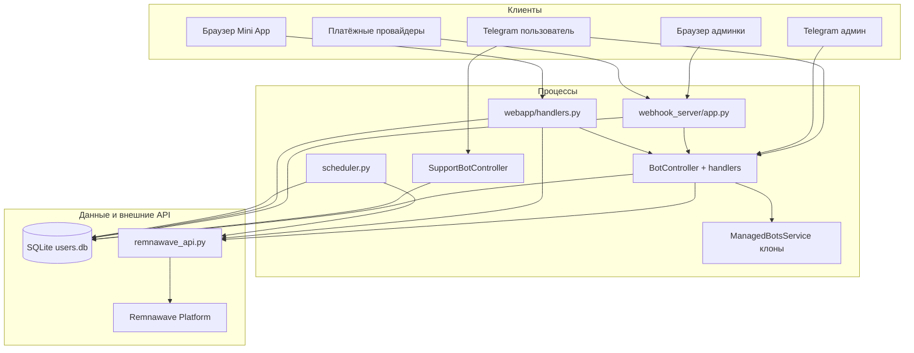

# Архитектура Xatabchik

Карта процессов, модулей и потоков данных. Полный перечень функций — в [docs/FUNCTIONS_CATALOG.md](docs/FUNCTIONS_CATALOG.md). Кто кого вызывает и зачем — в [FUNCTIONS_AND_RELATIONS.md](FUNCTIONS_AND_RELATIONS.md). Помодульный разбор с call site’ами — [MODULES_AND_FUNCTIONS.md](MODULES_AND_FUNCTIONS.md).

Код в этом цикле **не менялся**. Документация сверена с исходниками на ветке `main` (состояние репозитория на момент обхода).

---

## Что это за система

Xatabchik — магазин VPN-конфигураций Remnawave:

1. **Основной Telegram-бот** (`aiogram`) — витрина: регистрация, тарифы, оплата, ключи, рефералка, подарки.
2. **Support-бот** — отдельный процесс/loop: тикеты пользователя ↔ форум-топики админов.
3. **Flask-админка** — панель, вебхуки платёжек, аналитика, модули, франшиза.
4. **FastAPI Mini App** — веб-кабинет пользователя (тот же `users.db`).
5. **Планировщик** — фоновые задачи на event loop основного бота.
6. **Плагины** в `modules/` — горячее подключение без правки ядра.

Два Docker-сервиса (`docker-compose.yml`):

| Сервис | Процесс | Порт внутри |
|--------|---------|-------------|
| `xatabchik` | `python -m shop_bot` → Flask + боты + scheduler | `1488` |
| `xatabchik-webapp` | `uvicorn shop_bot.webapp.handlers:app` | `8000` → хост `8001` |

---

## Точки входа

```
__main__.py
  ├─ remnawave_repository.initialize_db()     # schema + migrations
  ├─ BotController()                          # свой thread + asyncio loop
  ├─ create_webhook_app(bot_controller)       # Flask
  │     └─ SupportBotController (модульный синглтон панели)
  ├─ Flask thread: host SHOPBOT_FLASK_HOST, port SHOPBOT_FLASK_PORT (1488)
  ├─ автозапуск main/support по bot_settings
  └─ periodic_subscription_check(bot_controller)  на loop основного бота
```

`src/shop_bot/app.py` — **не** runtime. Это одноразовый hotfix-скрипт для патча `webhook_server/app.py`.

---

## Слои и ответственность



| Слой | Файлы | Зачем |
|------|--------|-------|
| Контроллеры ботов | `bot_controller.py`, `support_bot_controller.py`, `factory_bot/service.py` | Старт/стоп polling, изоляция loop |
| Пользовательский бот | `bot/handlers.py`, `bot/keyboards.py`, `config.py` | Воронка продаж и ЛК в Telegram |
| Админ-бот | `bot/admin_handlers.py` | Операционка без браузера |
| Панель | `webhook_server/app.py` | CRUD, аналитика, вебхуки, модули |
| Mini App | `webapp/handlers.py` | Тот же магазин в браузере/WebApp |
| Репозиторий | `data_manager/database.py`, `remnawave_repository.py` | Единая SQLite + фасад |
| VPN API | `modules/remnawave_api.py` | Выдача/продление ключей, LTE, HWID |
| Платежи | `modules/*_api.py`, `platega_fulfillment.py`, вебхуки Flask | Инвойс → pending → fulfillment |
| Плагины | `core/module_*.py`, `modules/*` | Расширения без правки ядра |

---

## Потоки данных

### Покупка / продление / top-up / LTE / подарок

1. Бот или Mini App создаёт `pending_transactions` через `rw_repo.create_payload_pending` (в метаданные пишется `factory_bot_id`, если это клон).
2. Провайдер отдаёт ссылку на оплату (YooKassa, Platega, RollyPay, CryptoBot, Heleket, YooMoney, TON, Stars).
3. Вебхук Flask **или** native `successful_payment` (Stars) **или** кнопка «проверить» вызывает `_dispatch_payment_processing`.
4. Центральный fulfillment — `bot/handlers.py::process_successful_payment`.
5. Он вызывает `remnawave_api.create_or_update_key_on_host` / `ensure_user` и пишет ключ через `rw_repo.record_key_from_payload` / `extend_key`.
6. Рефералка и комиссия франшизы (`accrue_partner_commission`) считаются здесь же.

Mini App и панель **не дублируют** выдачу ключа: они делегируют в `process_successful_payment`.

### Тикет поддержки

```
Пользователь (основной бот / Mini App / support-бот)
        → database.create_support_ticket + add_support_message
        → ticket_media.save_ticket_media*
        → форум-топик (support_bot)
Админ (панель / форум / админ-кнопки support-бота)
        → ответ пишется в support_messages и уходит пользователю
scheduler каждые 5 мин
        → idle_close.maybe_auto_close_idle_tickets
        → purge вложений закрытых тикетов
```

### Франшиза

Root-бот при `franchise_enabled` поднимает `ManagedBotsService.start_all()`. Каждый клон получает те же `get_user_router()` + `get_owner_cabinet_router()`. `FactoryStatsMiddleware` пишет активность и выставляет `factory_bot_id` в ContextVar — от этого зависят pending-платежи и комиссии.

---

## Изоляция процессов

- Основной бот и support-бот имеют **свои** thread + asyncio loop. Падение одного не роняет другой и не роняет Flask.
- Планировщик крутится **на loop основного бота**, потому что шлёт сообщения через его `Bot`.
- Mini App — отдельный контейнер, общая БД и volume.
- Плагины ловятся `ModuleSafeMiddleware`: ошибка модуля → статус `error`, ядро живёт.

---

## Где искать дальше

| Тема | Документ |
|------|----------|
| Все функции по файлам | [docs/FUNCTIONS_CATALOG.md](docs/FUNCTIONS_CATALOG.md) |
| Модули и вызовы функций | [MODULES_AND_FUNCTIONS.md](MODULES_AND_FUNCTIONS.md) |
| Связи «кто → кого» | [FUNCTIONS_AND_RELATIONS.md](FUNCTIONS_AND_RELATIONS.md) |
| Хендлеры бота | [BOT_HANDLERS_DOCUMENTATION.md](BOT_HANDLERS_DOCUMENTATION.md) |
| Админ-панель и вебхуки | [ADMIN_PANEL_DOCUMENTATION.md](ADMIN_PANEL_DOCUMENTATION.md) |
| Платежи | [PAYMENTS_DOCUMENTATION.md](PAYMENTS_DOCUMENTATION.md) |
| Support-бот | [SUPPORT_BOT_DOCUMENTATION.md](SUPPORT_BOT_DOCUMENTATION.md) |
| Планировщик | [SCHEDULER_DOCUMENTATION.md](SCHEDULER_DOCUMENTATION.md) |
| SQLite | [DATABASE_DOCUMENTATION.md](DATABASE_DOCUMENTATION.md) |
| Mini App | [WEBAPP_MINIAPP_DOCUMENTATION.md](WEBAPP_MINIAPP_DOCUMENTATION.md) |
| Плагины | [MODULES_DOCUMENTATION.md](MODULES_DOCUMENTATION.md) |
| Франшиза | [FRANCHISE_IMPLEMENTATION.md](FRANCHISE_IMPLEMENTATION.md) |

Индекс всех markdown-файлов: [DOCUMENTATION.md](DOCUMENTATION.md).
