<div align="center" markdown>
  <h1>Xatabchik | Telegram-бот для продажи VPN</h1>
  <p align="center">
    <a href="#-расширение-функциональности-модули">Модули</a> •
    <a href="#%EF%B8%8F-установка-под-ключ">Установка и обновление</a> •
    <a href="#-%D0%B1%D0%B0%D0%B3%D0%B8-%D0%B8-%D0%BF%D1%80%D0%B5%D0%B4%D0%BB%D0%BE%D0%B6%D0%B5%D0%BD%D0%B8%D1%8F">Баги и предложения</a> •
    <a href="https://hostoff.link/invite/CODEA9517418">Рекомендуемый хостинг</a>
  </p>
  <p align="center">
    <a href="https://github.com/Xatabchik/Xatabchik/releases" target="_blank">
      
    </a>
    <a href="https://github.com/Xatabchik/Xatabchik/releases" target="_blank">
      
    </a>
    <a href="https://github.com/Xatabchik/Xatabchik/blob/main/LICENSE" target="_blank">
      
    </a>
    <a href="https://github.com/Xatabchik/Xatabchik/commits" target="_blank">
      
    </a>
    <a href="https://github.com/Xatabchik/Xatabchik/issues" target="_blank">
      
    </a>
    <a href="https://github.com/Xatabchik/Xatabchik/stargazers" target="_blank">
      
    </a>
    <a href="https://www.python.org/downloads/" target="_blank">
      
    </a>
  </p>
</div>

**Xatabchik** — комплексное решение для автоматизированной продажи VPN‑конфигураций через Telegram с веб‑панелью на базе Tabler, Telegram Mini App и интеграцией с Remnawave Platform.

Карта кода и функций: [DOCUMENTATION.md](DOCUMENTATION.md) · [ARCHITECTURE.md](ARCHITECTURE.md) · [FUNCTIONS_AND_RELATIONS.md](FUNCTIONS_AND_RELATIONS.md).

---

## Основные возможности

- Полностью автоматизированная воронка: онбординг пользователя, проверка подписки и выдача конфигурации сразу после оплаты.
- Единая панель управления: управление хостами Remnawave Platform, тарифами, пользователями, платежами, журналами и спидтестами.
- Telegram Mini App (FastAPI): тот же кабинет в браузере — ключи, оплата, тикеты, email-вход.
- Гибкая биллинг-модель: множество серверов, индивидуальные тарифы, пробные периоды, докупка ГБ/LTE, реферальные начисления.
- Платежи: YooKassa, YooMoney, Platega, RollyPay, CryptoBot, Heleket, TON Connect, Telegram Stars, баланс и реферальный баланс. Вебхуки и чеки YooKassa.
- Support-бот с тикетами (форум-топики) плюс тикеты из основного бота и Mini App.
- Франшиза: управляемые клоны бота на той же БД с комиссией партнёра.
- Плагины в `modules/` без перезапуска ядра.
- Отчёты и диагностика: принудительная подписка, SSH/net-probe speedtest, мониторинг ресурсов.

## 🖼️ Скриншоты
<details>
  <summary><b>Показать скриншоты</b></summary>

  <br>

  ### Веб‑панель

  <table>
    <tr>
      <td align="center" valign="top">
        <a href="docs/screenshots/dashboard.png">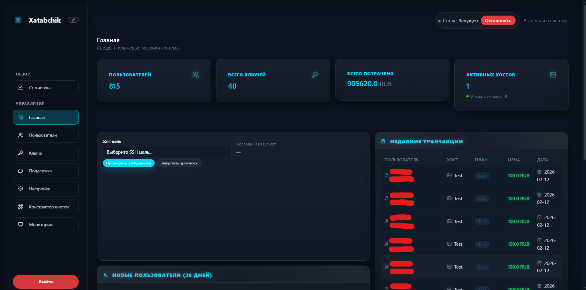</a><br>
        <sub>Дашборд</sub>
      </td>
      <td align="center" valign="top">
        <a href="docs/screenshots/settings.png">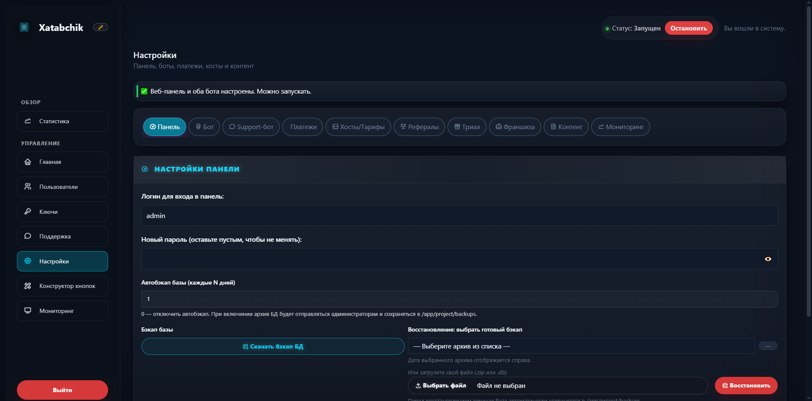</a><br>
        <sub>Настройки</sub>
      </td>
    </tr>
    <tr>
      <td align="center" valign="top">
        <a href="docs/screenshots/statistic.png">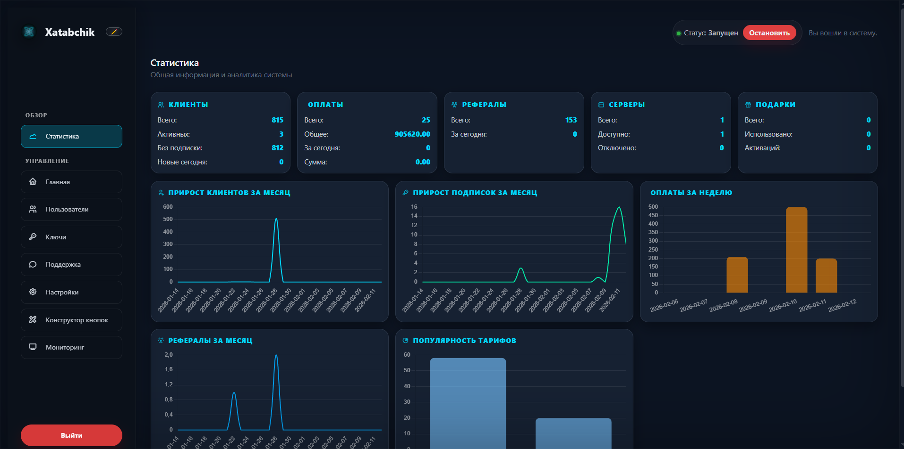</a><br>
        <sub>Статистика и рефералы</sub>
      </td>
      <td align="center" valign="top">
        <a href="docs/screenshots/monitor.png">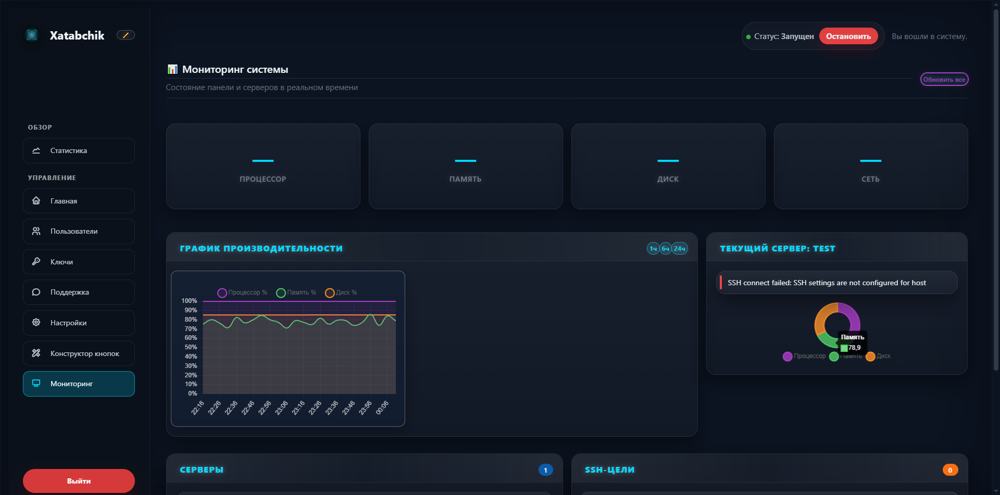</a><br>
        <sub>Мониторинг системы</sub>
      </td>
    </tr>
    <tr>
      <td align="center" valign="top">
        <a href="docs/screenshots/button_design.png">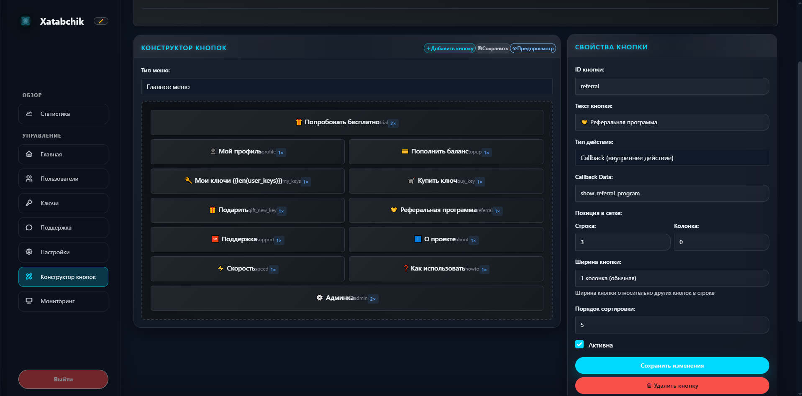</a><br>
        <sub>Конструктор кнопок</sub>
      </td>
      <td align="center" valign="top">
        <a href="docs/screenshots/preview.png">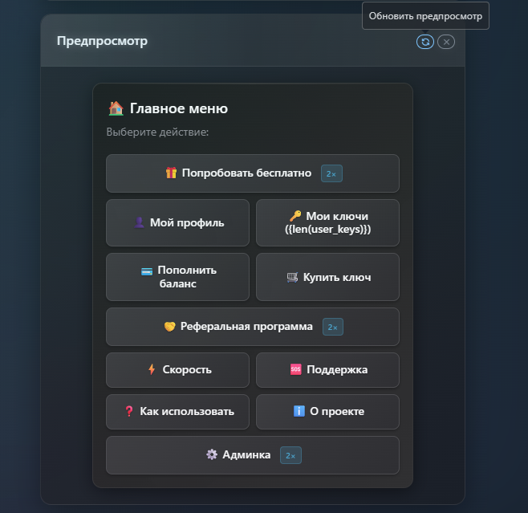</a><br>
        <sub>Предпросмотр меню</sub>
      </td>
    </tr>
  </table>

  ### Бот (Telegram)

  <table>
    <tr>
      <td align="center" valign="top">
        <a href="docs/screenshots/bot-main-menu.png">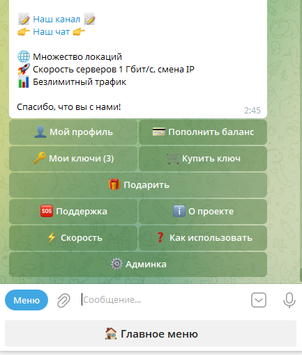</a><br>
        <sub>Главное меню</sub>
      </td>
      <td align="center" valign="top">
        <a href="docs/screenshots/bot-user-menu.png">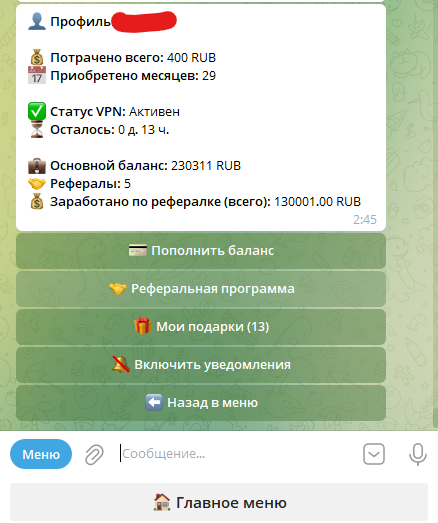</a><br>
        <sub>Меню пользователя</sub>
      </td>
      <td align="center" valign="top">
        <a href="docs/screenshots/bot-admin-menu.png">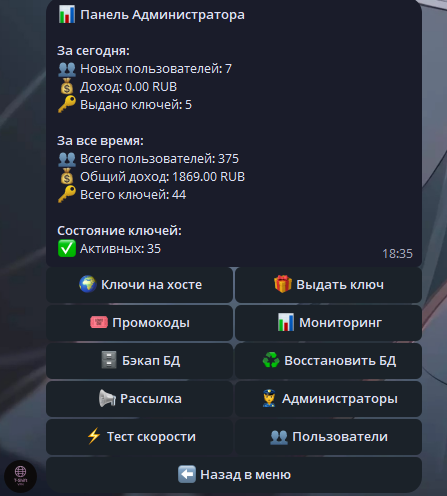</a><br>
        <sub>Админ‑меню</sub>
      </td>
    </tr>
    <tr>
      <td align="center" valign="top">
        <a href="docs/screenshots/bot-settings.png">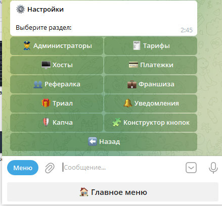</a><br>
        <sub>Настройки</sub>
      </td>
      <td align="center" valign="top">
        <a href="docs/screenshots/help.png">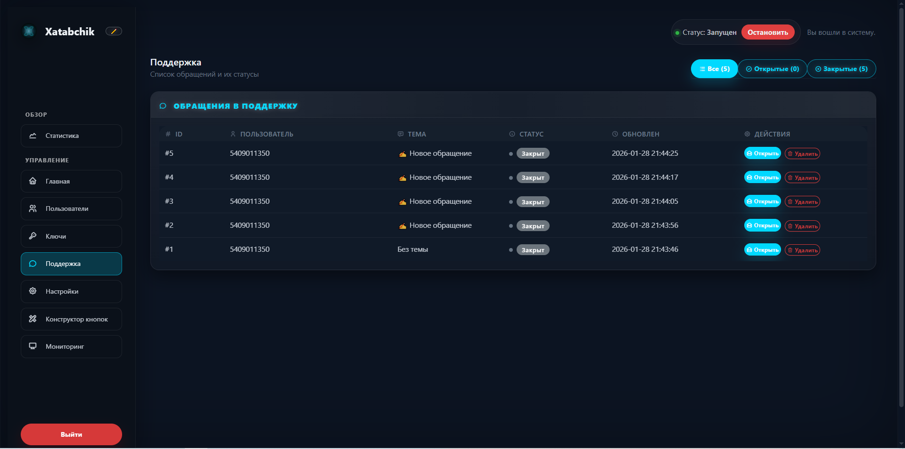</a><br>
        <sub>Справка и поддержка</sub>
      </td>
      <td></td>
    </tr>
  </table>

  <br>
  <i>Клик по миниатюре откроет оригинал в полном размере.</i>
</details>

---

## ⚠️ Требования
1) Сервер Ubuntu/Debian с доступом по SSH.
2) Домен, A‑запись которого указывает на IP сервера.
3) Установленная Remnawave Platform на целевых хостах.


---

## 🛠️ Установка «под ключ»
Скрипт поставит Docker, Nginx, Certbot, скачает и развернёт бота и панель.

1) Подключитесь по SSH.

2) Выполните:

```bash
curl -sSL https://raw.githubusercontent.com/Xatabchik/Xatabchik/main/install.sh | bash
```

3) Следуйте инструкциям установщика:
- Введите домен (например, `shop.example.com`).
- Укажите email для SSL (Let's Encrypt).
- Выберите порт для вебхуков (443 или 8443, по умолчанию 8443).
- Скрипт автоматически поднимет контейнеры и выпишет сертификат.

4) По завершении получите URL панели и первичные доступы:
```
Веб‑панель: https://your-domain.com:8443/login
Логин: admin
Пароль: admin
```

---

## ⚙️ Первичная настройка
1) Войдите в панель и сразу смените логин/пароль в «Настройки → Настройки панели».
2) Заполните Telegram‑параметры: `Токен бота`, `Имя телеграмм бота`, `ID администратора в телеграмме`.
3) Добавьте хост Remnawave Platform в «Настройки → Управление хостами» (URL, доступы и параметры подключения).
4) Создайте тарифы для добавленного хоста (месяцы/цена).
5) Сохраните настройки и нажмите «Запустить бота» в шапке панели.

Бот готов к работе.

---

## 💳 Платёжные системы
Откройте «Настройки → Настройки платёжных систем» и заполните соответствующие поля.  
Полное описание провайдеров, вебхуков и `process_successful_payment`: [PAYMENTS_DOCUMENTATION.md](PAYMENTS_DOCUMENTATION.md). Поля настроек: [BOT_SETTINGS_GUIDE.md](BOT_SETTINGS_GUIDE.md).

Вебхуки принимают Flask-панель. Если при установке выбран порт `8443`, добавьте его к URL.

### YooKassa
- Укажите `yookassa_shop_id` и `yookassa_secret_key`.
- URL вебхука: `https://your-domain.com/yookassa-webhook` (или `:8443/yookassa-webhook`).
- При желании добавьте почту для чеков.

### YooMoney
- Кошелёк, секрет уведомлений, опционально API-токен и OAuth (`/yoomoney/connect`).
- Вебхук: `https://your-domain.com/yoomoney-webhook`.

### Platega
- `platega_merchant_id`, `platega_secret`, `platega_base_url` (по умолчанию `https://app.platega.io`).
- Вебхук: `https://your-domain.com/platega-webhook` (GET и POST). Телу колбэка панель не доверяет — статус сверяется API.

### RollyPay
- `rollypay_api_key`, `rollypay_signing_secret`, опционально `rollypay_terminal_id`.
- Базовый URL зафиксирован в коде (`https://api.rollypay.io/api/v1`).
- Вебхук: `https://your-domain.com/rollypay-webhook` (HMAC `X-Signature`).

### CryptoBot
- Токен в [@CryptoBot](https://t.me/CryptoBot) → Crypto Pay.
- Вебхук: `https://your-domain.com/cryptobot-webhook`.
- Поле: `cryptobot_token`.

### Heleket
- `heleket_merchant_id` и `heleket_api_key`.
- Вебхук: `https://your-domain.com/heleket-webhook`.

### TON Connect (опционально)
- `ton_wallet_address` и `tonapi_key`.
- Вебхук: `https://your-domain.com/ton-webhook`.

### Telegram Stars
- Флаг `stars_enabled` и курс `stars_per_rub` (> 0).
- Подтверждение приходит апдейтом бота `successful_payment`, не вебхуком Flask.

### Баланс и реферальный баланс
Всегда доступны в боте и Mini App, если на счёте достаточно средств. Провайдер не вызывается.

---

## 🔗 Принудительная подписка и ссылки
Ключевые настройки задаются в БД через веб‑панель:
- `force_subscription`: включить/выключить обязательную подписку (`true`/`false`).
- `channel_url`: ссылка на канал/чат для подписки. Бот должен быть админом канала.
- `terms_url`, `privacy_url`: ссылки на условия и политику — используются в онбординге.

---

## 🧪 Тест скорости (Speedtest)
Тесты скорости доступны из админ‑меню бота и из панели.

Поддерживаются 2 метода:
- SSH‑Speedtest: запуск `speedtest`/`speedtest-cli` на удалённом сервере по SSH.
- Net‑Probe: лёгкая сетевая проверка доступности и задержки HTTP с панели до `host_url`.

Результаты сохраняются в БД и видны на дашборде у каждого хоста.

### Настройки для SSH‑Speedtest на хосте
Откройте «Настройки → Управление хостами → SSH‑параметры» и заполните:
- `ssh_host` — адрес сервера
- `ssh_port` — порт (по умолчанию 22)
- `ssh_user` — пользователь
- `ssh_password` — пароль (или пусто, если используется ключ)
- `ssh_key_path` — путь к приватному ключу на машине панели (контейнер)

Можно запустить «Автоустановку speedtest» из админ‑меню и из веб‑панели.

### Запуск
- В боте: Админ‑меню → Speedtest → выбрать хост или «Запустить для всех».
- В панели: кнопка «Run speedtests» на дашборде.

---

## 🤝 Реферальная система
Основные параметры — в таблице настроек («Настройки → Общие»).
Типы начислений:
- Процент с покупки реферала
- Фиксированная сумма за покупку реферала
- Фиксированный бонус пригласившему при старте по реферальной ссылке

Дополнительно:
- Скидка для приглашённого (в процентах), если используется
- Минимальная сумма на вывод/перевод (если заложено в вашей бизнес‑логике)

Рефссылка формируется как: `https://t.me/<bot_username>?start=ref_<telegram_id>`.

---

## 🆘 Настройки поддержки (Support)

Подробности тикетов, вложений и автозакрытия: [SUPPORT_BOT_DOCUMENTATION.md](SUPPORT_BOT_DOCUMENTATION.md).

Доступны режимы:

1) Встроенный support‑бот с тикетами
   - Поля: `support_bot_token`, `support_bot_username`, `support_forum_chat_id`.
   - Пользователь пишет боту; админы отвечают в форум-топике. Те же тикеты видны в панели (`/support`) и Mini App.
   - Автозапуск: `auto_start_support_bot`.

2) Тикеты в основном боте
   - Раздел «Помощь» создаёт записи в тех же таблицах `support_tickets` / `support_messages`.

3) Внешний контакт
   - Поле: `support_user` (например, `@username`).
   - Кнопка ведёт в личные сообщения указанному контакту.

`support_text` — текст кнопки/заглушки.

---

## 🧩 Расширение функциональности (модули)
Xatabchik поддерживает расширяемую архитектуру через модульную систему. Вы можете создавать и загружать собственные модули без перезагрузки приложения.

**Документация:**
- [**DOCUMENTATION.md**](DOCUMENTATION.md) — индекс всех руководств
- [**ARCHITECTURE.md**](ARCHITECTURE.md) — процессы и слои
- [**FUNCTIONS_AND_RELATIONS.md**](FUNCTIONS_AND_RELATIONS.md) — функции и связи
- [**MODULES_DOCUMENTATION.md**](MODULES_DOCUMENTATION.md) — создание модулей, структура, безопасность
- [**MODULE_DISTRIBUTION.md**](MODULE_DISTRIBUTION.md) — упаковка и распространение ZIP

**Загрузка модулей:**
1. Подготовьте модуль в виде ZIP архива (см. документацию)
2. Перейдите в админ-панель → **🧩 Модули**
3. Загрузите ZIP файл через форму
4. Модуль автоматически установится и будет включён

**Встроенные возможности модулей:**
- Телеграм-обработчики (команды, колбэки, тексты)
- Веб-маршруты и статические файлы
- Интеграция с базой данных
- Фоновые задачи и планировщик
- Динамические кнопки в меню и клавиатурах

---

## 🔄 Управление и обновление
Все команды выполняются в каталоге проекта на сервере (папка `Xatabchik`).

Просмотр логов в реальном времени:
```bash
docker-compose logs -f
```

Остановка контейнеров:
```bash
docker-compose down
```

Запуск в фоне:
```bash
docker-compose up -d
```

**Обновить до последней версии:**
```bash
cd ~/xatabchik
git pull origin main
docker compose up -d --build
```

---

## 📚 Документация по коду

| Документ | О чём |
|----------|--------|
| [DOCUMENTATION.md](DOCUMENTATION.md) | Полный индекс |
| [ARCHITECTURE.md](ARCHITECTURE.md) | Архитектура процессов |
| [FUNCTIONS_AND_RELATIONS.md](FUNCTIONS_AND_RELATIONS.md) | Что / где / зачем по модулям |
| [docs/FUNCTIONS_CATALOG.md](docs/FUNCTIONS_CATALOG.md) | Каталог всех функций |
| [MODULES_AND_FUNCTIONS.md](MODULES_AND_FUNCTIONS.md) | Модули: где используются и кто вызывает функции |
| [BOT_HANDLERS_DOCUMENTATION.md](BOT_HANDLERS_DOCUMENTATION.md) | Telegram-хендлеры |
| [ADMIN_PANEL_DOCUMENTATION.md](ADMIN_PANEL_DOCUMENTATION.md) | Flask-панель |
| [WEBAPP_MINIAPP_DOCUMENTATION.md](WEBAPP_MINIAPP_DOCUMENTATION.md) | Mini App |
| [PAYMENTS_DOCUMENTATION.md](PAYMENTS_DOCUMENTATION.md) | Платежи |
| [DATABASE_DOCUMENTATION.md](DATABASE_DOCUMENTATION.md) | SQLite |
| [SCHEDULER_DOCUMENTATION.md](SCHEDULER_DOCUMENTATION.md) | Фоновые задачи |
| [FRANCHISE_IMPLEMENTATION.md](FRANCHISE_IMPLEMENTATION.md) | Клоны ботов |

## 🙌 Баги и предложения
Нашли баг или есть идея? Создайте Issue или пришлите Pull Request.

## Лицензия
Проект распространяется по лицензии [GPLv3](LICENSE).
